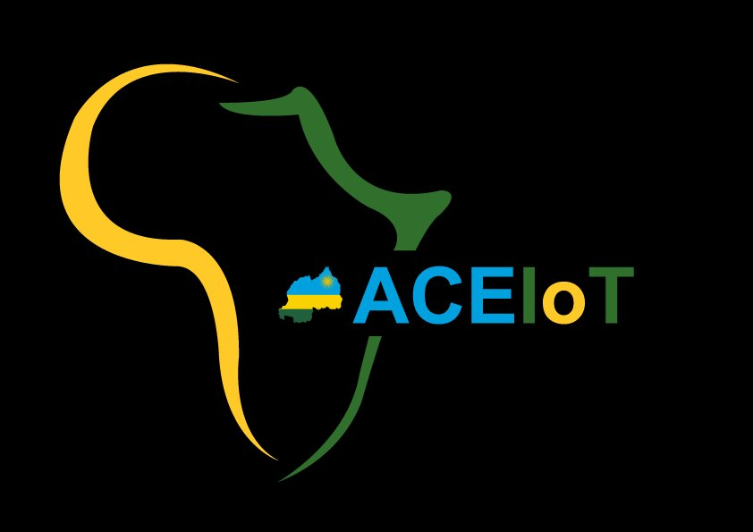

# Welcome to My Fabrication Portfolio

Making Things

Documenting my journey through digital fabrication and IoT prototyping

    

        
    

    

        
    

    <strong>Kirenga Olivier</strong> | Student ID: 224020861 
    MSc in IoT Embedded Computing Systems 
    University of Rwanda - Advanced Centre for IoT (ACEIoT)

## About This Portfolio

This portfolio documents my learning journey through the **Modelling and Fabrication Techniques** course offered by FabLab Rwanda in partnership with UR-ACEIoT. Throughout this course, I explore the intersection of digital design, electronics, and physical fabrication—skills essential for modern IoT system development.

---

## Course Topics

    
📚

    
Foundation

    

        Documentation practices, version control with Git/GitHub, and establishing professional workflows for technical projects.
    

     
    <a href="foundation/" class="md-button md-button--primary">Explore Foundation →</a>

    
🎨

    
Digital Design

    

        3D modeling with FreeCAD, 2D vector graphics with Inkscape, and design-for-manufacturing principles for real-world production.
    

     
    <a href="design/" class="md-button md-button--primary">Explore Design →</a>

    
⚡

    
Electronics

    

        PCB design fundamentals, microcontroller circuits, KiCad workflows, and preparing designs for fabrication through milling.
    

     
    <a href="electronics/" class="md-button md-button--primary">Explore Electronics →</a>

    
🔧

    
Manufacturing

    

        Material selection, fabrication methods (CNC, laser cutting, 3D printing), and understanding the relationship between design and production.
    

     
    <a href="manufacturing/" class="md-button md-button--primary">Explore Manufacturing →</a>

---

## Course Structure

    <h3>Foundation: Documentation & Web Development</h3>
    
Establishing professional documentation practices using MkDocs, Git, and GitHub Pages.

    <h3>Digital Design: CAD & Vector Graphics</h3>
    
Learning parametric 3D modeling and precision 2D design for fabrication.

    <h3>Electronics: PCB Design & Fabrication</h3>
    
Designing functional circuits for microcontroller-based IoT systems.

    <h3>Manufacturing: Materials & Methods</h3>
    
Exploring material properties and fabrication techniques for physical prototypes.

---

## Tools & Technologies

**Design Software:** FreeCAD, Inkscape, KiCad, OpenSCAD

**Development Tools:** MkDocs Material, Git & GitHub, GitHub Pages

**Fabrication Equipment:** CNC Router, Laser Cutter, PCB Milling Machine, 3D Printers

---

    

        This documentation is part of the <strong>Modelling and Fabrication Techniques</strong> course 
        offered by <strong>FabLab Rwanda</strong> in partnership with <strong>UR-ACEIoT</strong>
    

